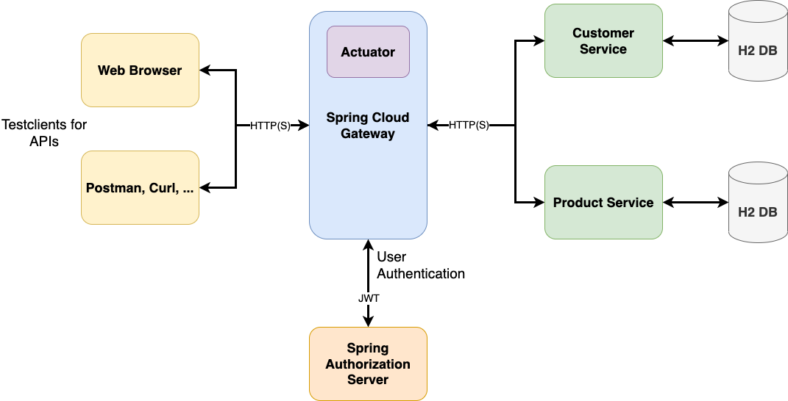

# Microservices on the Edge with Spring Cloud Gateway (Hands-On Workshop)

A hands-on workshop to build an API-Gateway using the [Spring Cloud Gateway](https://spring.io/projects/spring-cloud-gateway).

## Table of Contents

* [Workshop Tutorial](#workshop-tutorial)
* [Introduction](introduction)
* [Hands-On Workshop](#hands-on-workshop)
  * [Intro Lab](#intro-lab)
  * [Hands-On Labs](#hands-on-labs)
* [Feedback](#feedback)
* [License](#license)

## Workshop Tutorial

To follow the hands-on workshop please open the [workshop tutorial](https://andifalk.gitbook.io/spring-cloud-gateway-workshop/).

## Introduction

The sample application architecture you will build (and use) looks like this:

* [Prerequisites](prerequisites/README.md)
* [Requirements and Setup](setup/README.md)
* [Introduction to Spring Cloud Gateway](introduction/README.md)
* [Sample Application Architecture](architecture/README.md)

## Hands-On Workshop

### Intro Lab

* [Reactive Streams with Spring Reactor in Action](reactive-playground/README.md)

### Hands-On Labs

* [Lab 1: Routing - Configure & Monitor Gateway Routes](lab1/README.md)
* [Lab 2: Resilience - Retry, Circuit Breaking and Rate Limiting](lab2/README.md)
* [Lab 3: Security Part 1 - Authentication with JWT](lab3/README.md)
* [Lab 4: Security Part 2 - Secure Communication with TLS](lab4/README.md)
* [Lab 5: Customization - Customized Preconditions & Filters](lab5/README.md)

## Feedback

Any feedback on this hands-on workshop is highly appreciated.
Just email _andreas.falk(at)novatec-gmbh.de_ or contact me via Twitter (_@andifalk_).

## License

Apache 2.0 licensed

[1]:http://www.apache.org/licenses/LICENSE-2.0.txt
