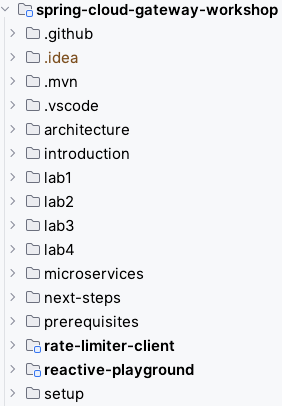

# Sample Application Architecture

## Architecture

As part of this workshop we will implement the following sample application architecture.

We will use the provided existing two microservices (customer and product services) to route these through the Spring Cloud Gateway.

* __Spring Cloud Gateway__: This is the component we will implement and extend during several labs
* __Customer Service__: A backend service providing a REST API for retrieving customers
* __Product Service__: A backend service providing a REST API for retrieving products
* __Spring Authorization Server__: An OAuth 2.1 & OpenID Connect 1.0 compliant authorization server that will be used to implement the cross-cutting gateway feature for user authentication with JSON web tokens (JWT)

## Configuration

These microservices are configured to be reachable via the following URL addresses (Port 8080 is the default port in spring boot).

Service URLs:

| Service                         | URL                   |
|---------------------------------|-----------------------|
| Spring Authorization Server     | http://localhost:9000 |
| Spring Cloud Gateway            | http://localhost:9090 |
| Customer Service (Customer API) | http://localhost:9091 |
| Product Service (Products API)  | http://localhost:9092 |

## Project contents

After importing the project into your IDE you should see a project structure like in the following picture. Here the VS Code project is shown, it may look different in other IDE's.

The main contents for this workshop consist of the following directories:

* __reactive-playground__:
  In this sub-directory you find a demo application that provides a unit test class with lots of examples on implementing reactive streams using project reactor.
* __microservices__:
  Here you find the provided backend microservices, both implemented using Java and Spring Boot and providing a REST API. You find these in the following subdirectories:
    * customer-service
    * product-service
* __labs__:
  In this directory you find the workshop lab parts.
    * initial: This will be the starting point to implement code as part of this workshop
        - product: This is the provided sample product server microservice
        - ui: This is the provided sample product ui client microservice
    * solution: This is the reference solution for this workshop (please do NOT look into this now)
        - product: This is the reference solution of a OAuth2/OIDC product server microservice
        - ui: This is the reference solution of a OAuth2/OIDC product ui client microservice

> **Info:** You can find more information on building OAuth 2.0/OIDC secured microservices with spring in
[Spring Boot Reference Documentation](https://docs.spring.io/spring-boot/docs/current/reference/htmlsingle/#boot-features-security-oauth2)
and in [Spring Security Reference Documentation](https://docs.spring.io/spring-security/site/docs/current/reference/htmlsingle/#oauth2)

So let's start with our first hands-on lab.
