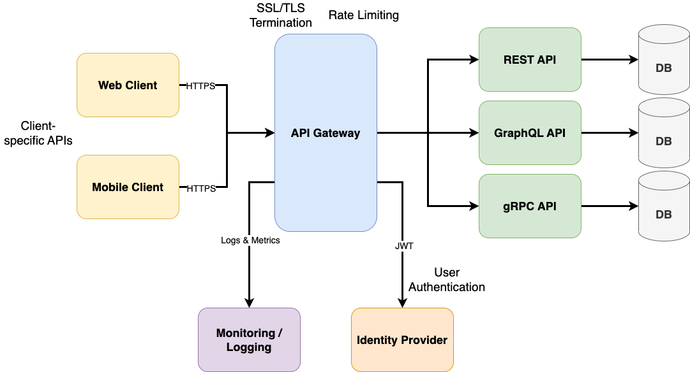
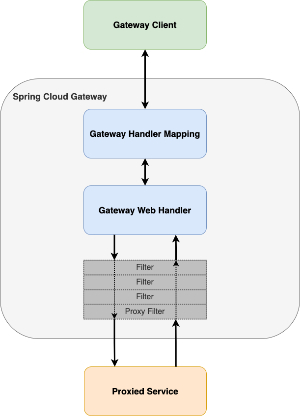
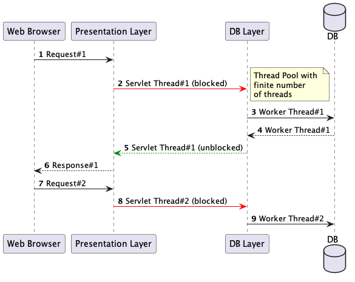
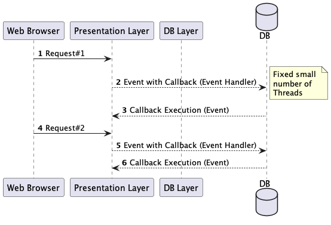
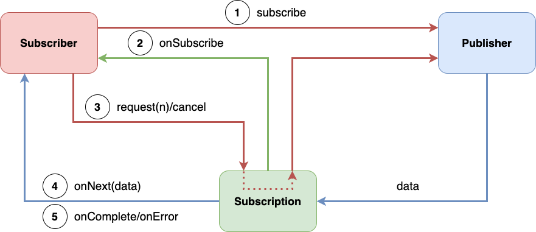

# Introduction to Spring Cloud Gateway

This section introduces the [API gateway](https://microservices.io/patterns/apigateway.html) pattern and one specific implementation of this pattern: The [Spring Cloud Gateway](https://spring.io/projects/spring-cloud-gateway).

## API Gateways

The granularity of [application programming interfaces (APIs)](https://en.wikipedia.org/wiki/API) provided by microservices is often different from what a client needs. [Microservices](https://microservices.io/patterns/microservices.html) typically provide fine-grained APIs, which means that clients need to interact with multiple services. Additionally different clients need different data or representations.

Typically, the solution for this is to implement an [API gateway](https://microservices.io/patterns/apigateway.html) that is the single entry point for all clients.
An API gateway acts as a reverse proxy to accept all application programming interface (API) calls, aggregate the various services required to fulfill them, and return the appropriate result.  
This way it provides a flexible way of routing requests based on a number of criteria (paths, http headers, etc.).  

It also focuses on cross-cutting concerns such as 
* Security (Authentication and Authorization)
* Resiliency (Rate limiting)
* Monitoring & analytics



## Spring Cloud Gateway

Spring Cloud Gateway provides a library for building API gateways on top of Spring and Java. It provides a flexible way of routing requests based on a number of criteria, as well as focuses on cross-cutting concerns such as security, resiliency, and monitoring.

In detail, it provides the following features:

* Match routes on any request attribute.
* Route specific predicates and filters
* Circuit Breaker integration.
* Spring Cloud DiscoveryClient integration
* Easy to write Predicates and Filters
* Request Rate Limiting
* Path Rewriting
* Token Propagation (Authentication)

Clients make requests to Spring Cloud Gateway. If the Gateway Handler Mapping determines that a request matches a route (using a route predicate), it is sent to the Gateway Web Handler. This handler runs the request through a filter chain that is specific to the request. Filters can run logic both before and after the proxy request is sent. First the gateway executes all _pre_-filter logic. Then the proxy request is made. After making the proxy request, the gateway runs the _post_-filter logic for the response.



The Spring Cloud Gateway is build on [Spring Framework 6](https://spring.io/projects/spring-framework), [Spring WebFlux](https://docs.spring.io/spring-framework/docs/current/reference/html/web-reactive.html#spring-web-reactive) [Project Reactor](https://projectreactor.io/) and [Spring Boot 3](https://spring.io/projects/spring-boot) 

### Spring WebFlux

The reactive-stack web framework, Spring WebFlux, was added in version 5.0 of [Spring Framework](https://spring.io/projects/spring-framework). It is fully non-blocking, supports [Reactive Streams](https://www.reactive-streams.org/) back pressure, and runs on such servers as [Netty](https://netty.io/), [Undertow](https://undertow.io/), and Servlet containers like [Tomcat](https://tomcat.apache.org/index.html).

It was created 

* to support the need for a non-blocking web stack to handle concurrency with a small number of threads and scale with fewer hardware resources
* to support functional programming and use functional APIs in Java

The blocking web stack (Standard Servlet API) blocks one request thread of the web server's thread pool during the whole request/response loop (i.e. waiting for a result from a database query). With many parallel requests more and more threads get blocked until all threads are consumed. This could lead to a denial of further requests to the web server.



In a non-blocking web stack (Spring WebFlux) all incoming requests come with an event handler and callback information. Request thread delegates the incoming requests to a thread pool (generally a small number of threads) which delegates the request to its handler function and immediately starts processing other incoming requests from the request thread.  
This way the non-blocking nature of threads helps in scaling the performance of the application. A small number of threads means less memory utilization and less context switching. This model enables web servers to handle much more parallel requests compared to a blocking web stack.



#### Reactive Systems & Reactive Streams

[Reactive Streams](https://www.reactive-streams.org/) follow the [Reactive Systems](https://www.reactivemanifesto.org/) paradigm  
Reactive Systems are:

* __Responsive__:  
The system responds in a timely manner if at all possible

* __Resilient__:  
The system stays responsive in the face of failure

* __Elastic__:  
The system stays responsive under varying workload

* __Message Driven__:  
Reactive Systems rely on asynchronous message-passing

[Reactive Streams](https://www.reactive-streams.org/) is an initiative created by engineers from Netflix, Pivotal, Lightbend, RedHat, Twitter and Oracle, amon others.
It provides a standard for asynchronous stream processing with non-blocking back pressure. The Reactive Streams API defines four interfaces that since Java 9 are also part of the Java API in the [java.util.concurrent.Flow](https://docs.oracle.com/javase/9/docs/api/java/util/concurrent/Flow.html) class.

__Publisher__

```java
interface Publisher<T> {
    void subscribe(Subscriber<? super T> s);
}
```

__Subscriber__

```java
interface Subscriber<T> {

    void onSubscribe(Subscription s);
    void onNext(T t);
    void onError(Throwable t);
    void onComplete();
}
```

__Subscription__

```java
interface Subscription<T> {
    void request(long n);
    void cancel();
}
```

The __Publisher__ emits a sequence of events to _Subscribers_ according to the demand received from its subscribers. A publisher can serve multiple subscribers.  
The __Subscriber__ receives and processes events emitted by a _Publisher_.    
The one-to-one relationship between a _Publisher_ and a _Subscriber_ is defined by a __Subscription__. It can only be used once by a single _Subscriber_. It is used to both signal desire for data and cancels demand (and allow resource cleanup).



There are many [Reactive Streams](https://www.reactive-streams.org/) implementations available like:

* [Akka](https://akka.io)
* [ReactiveX](https://reactivex.io/)
* [RxJS](https://rxjs.dev/)
* [Project Reactor](https://projectreactor.io/)

[Spring WebFlux](https://docs.spring.io/spring-framework/docs/current/reference/html/web-reactive.html#spring-web-reactive) builds upon [Project Reactor](https://projectreactor.io/).

Reactor fully implements [Reactive Streams](https://www.reactive-streams.org/) and extends it by offering two reactive and composable APIs:

__Flux:__  
A Reactive Streams Publisher with reactive extension operators that emits 0 to N elements, and then completes (successfully or with an error).


__Mono:__  
A Reactive Streams Publisher with basic reactive extension operators that emits at most one item via the `onNext` signal then terminates with an `onComplete` signal (successful Mono, with or without value), or only emits a single `onError` signal (failed Mono).


Using Spring WebFlux a _GET_ request mapping using Spring MVC annotation based programming model looks for example like this:

```java
public class BooksApi {
    @GetMapping("/books/{bookId}")
    public Mono<ResponseEntity<BookResource>> getBookById(
            @PathVariable("bookId") UUID bookId) {
        return bookService
                .findById(bookId)
                .map(bookResourceAssembler::toResource)
                .map(ResponseEntity::ok)
                .defaultIfEmpty(ResponseEntity.notFound().build());
    }
}
```


