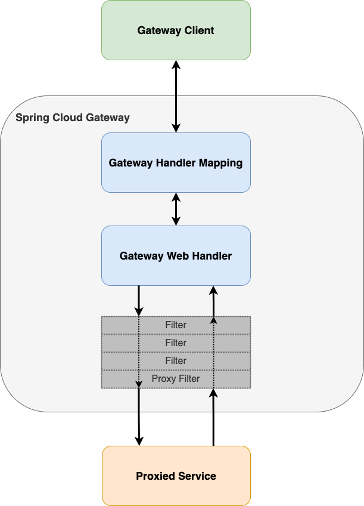

# Lab 1: Routing - Configure & Monitor Gateway Routes

In this first part we look at one of the core features of an API gateway: **Routing**.

> **Info:**   
> See [Spring Cloud Gateway Route Predicate Factories Reference Doc](https://docs.spring.io/spring-cloud-gateway/docs/current/reference/html/#gateway-request-predicates-factories) 
> for all details on how to configure a routing predicates.

## Lab Contents

* [Learning Targets](#learning-targets)
* [Folder Contents](#folder-contents)
* [Tutorial: Configure and Monitor Gateway Routes](#start-the-lab)
    * [Explore the initial gateway application](#explore-the-initial-application)
    * [Step 1: Add a route to the product-service](#step-1-add-a-route-to-the-product-service)
    * [Step 2: Add a route to the customer service](#step-2-add-a-route-to-the-customer-service)
    * [Step 3: Add a route for canary testing of customer service](#step-3-add-a-route-for-canary-testing-of-customer-service)
    * [Step 4: Enable a route to a hidden endpoint](#step-4-enable-route-to-hidden-endpoint-of-customer-service)
    * [Step 5: Configure routes with the Fluent Java Routes API](#step-5-configure-routes-with-the-fluent-java-routes-api-)
    * [Step 6: Monitor routes and route metrics](#step-6-monitor-routes-and-route-metrics)

## Learning Targets

In this lab you will basically learn how the spring cloud gateway works with route predicates and gateway filters.
The _Gateway Handler Mapping_ determines if a request matches the configured route predicates. If a match is found then the _Gateway Web Handler_ runs the request through a filter chain specific to this request. First, in the request all configured _pre_-filters are executed. Then the proxied service is called. Finally, all configured _post_-filters are executed for the response.  



In lab 1 you will learn how to:

* Configure route predicates and filters using both, 
  * the declarative approach in the `application.yml` file 
  * the functional approach in Java code using a `RouteLocatorBuilder` and the [fluent Java routes API](https://docs.spring.io/spring-cloud-gateway/docs/current/reference/html/#fluent-java-routes-api)
* Configure routes from clients to the customer-service and product-service backend microservices
* Configure basic filters like the `RewritePath` and `RedirectTo` filters.
* How to monitor configured route definitions and corresponding filters using the actuator endpoint

## Folder Contents

In the lab 1 folder you find 2 applications:

* __initial__: This is the gateway application we will use as starting point for this lab
* __solution__: This is the completed reference solution of the gateway application for this lab including all route predicates and filters we introduce during this lab

## Start the Lab

Now, let's start with this lab.

### Explore the initial application

Please navigate your Java IDE to the __lab1/initial/api-gateway__ project and explore this project a bit. Then start the application by running the class `com.example.apigateway.ApiGatewayApplication` inside your IDE or by issuing a `mvnw[.sh|.cmd] spring-boot:run` command.

If you have not yet seen the sample application architecture we will be building starting with this lab then please look into the [sample application architecture](../architecture).

For this lab we will also need the two provided sample backend services that you can find in the _microservices_ root folder:

* product-service: Provides a REST API for products
* customer-service: Provides a REST API for customers

To test if the backend microservice applications works as expected, please run the corresponding spring boot starter classes and check if you can access the following REST API endpoints via the browser or the provided postman collection in _/setup/postman_:

* [localhost:9092/api/v1/products](http://localhost:9091/api/v1/customers)
* [localhost:9092/api/v1/products](http://localhost:9092/api/v1/products)

You may also use a command-line client as well.
Here are example requests using _httpie_ and _curl_. 

Httpie:
```shell
http localhost:9091/api/v1/customers
http localhost:9092/api/v1/products
``` 

Curl:
```shell
curl http://localhost:9091/api/v1/customers
curl http://localhost:9092/api/v1/products
```

<hr>

### Step 1: Add a route to the product-service

First start using the declarative approach to define routes.  
Every routes entry in the `application.yml` has the following attributes:

* id: Every route requires a unique identifier
* uri: This is the target [Uniform Resource Identifier (URI)](https://en.wikipedia.org/wiki/Uniform_Resource_Identifier) for the routing request
* predicates: This list of route predicates defines how a request is matched against a configured route
* filters: This list of gateway filters defines _pre_- and _post_-filters for the HTTP request and response

Please open the file `src/main/resources/application.yml` in the _/lab1/initial/api-gateway_ project and add the following entries (please note that you add these below the existing `application.name` entry):

application.yml:

```yaml
spring:
  application:
    name: api-gateway
  cloud:
    gateway:
      routes:
        - id: products
          uri: http://localhost:9092
          predicates:
            - Path=/api/v1/products
```

This defines a route from [localhost:9090/api/v1/products (gateway)](http://localhost:9090/api/v1/products)  to [localhost:9092/api/v1/products (product-service)](http://localhost:9092/api/v1/products).

Now (re-)start the api-gateway application and make sure you also have started the _product-service_ microservice located in _/microservices/product-service_.
Next try to call the new route at http://localhost:9090/api/v1/products using either the web browser or the provided postman collection (corresponding request in folder _routing_)

### Step 2: Add a route to the customer-service

Now similar to the previous routing let's add a new route entry for the customer-service microservice.
What's different to the previous one is that we need to define a route that matches both API versions provided by the customer-service:

* http://localhost:9091/api/v1/customers
* http://localhost:9091/api/v2/customers

Open the file `src/main/resources/application.yml` in the _/lab1/initial/api-gateway_ project and add the following entries with id _customers_ after the previous routing entries:

application.yml:

```yaml
spring:
  application:
    name: api-gateway
  cloud:
    gateway:
      routes:
        - id: products
          uri: http://localhost:9092
          predicates:
            - Path=/api/v1/products

        - id: customers
          uri: http://localhost:9091
          predicates:
            - Path=/api/v1/{segment},/api/v2/{segment}
```

Maybe you spotted already the difference. Here we introduced the placeholder `{segment}` for a subsequent segment after the defined root paths.
So several possible paths would match this predicate:

* http://localhost:9090/api/v1/customers
* http://localhost:9090/api/v2/customers
* http://localhost:9090/api/v1/products
* http://localhost:9090/api/v1/test
* http://localhost:9090/api/v2/dummy

The desired route that we wanted to achieve are these:
* From [localhost:9090/api/v1/customers (gateway)](http://localhost:9090/api/v1/customers)  to [localhost:9091/api/v1/customers (customer-service)](http://localhost:9091/api/v1/customers)
* From [localhost:9090/api/v2/customers (gateway)](http://localhost:9090/api/v2/customers)  to [localhost:9091/api/v2/customers (customer-service)](http://localhost:9091/api/v2/customers)

This route also would match the previous route of http://localhost:9090/api/v1/products but as we have already defined a more concrete route for products as the first entry that one will be used.

Now (re-)start the api-gateway application and make sure you also have started the _customer-service_ microservice located in _/microservices/customer-service_.
Next try to call the new route at http://localhost:9090/api/v1/customers or http://localhost:9090/api/v2/customers using either the web browser or the provided postman collection (corresponding requests in folder _routing_).

### Step 3: Add a route for canary testing of customer service

Now we want to add a route to implement [canary testing (canary release)](https://www.techslang.com/definition/what-is-canary-testing/).
This technique is used to test new functionality with a small group before generally rolling out thius functionality to all users.

In spring cloud gateway this can be done by using the `weight` precondition type. With this you can for example tell the gateway to route 80 percent of requests to the production version V1 of the customers API and 20 percent of requests to the new functionality of the V2 customers API.

So let's do this (again in the 'application.yml' file):

application.yml:

```yaml
spring:
  application:
    name: api-gateway
  cloud:
    gateway:
      routes:
        - id: products
          uri: http://localhost:9092
          predicates:
            - Path=/api/v1/products
        - id: customers
          uri: http://localhost:9091
          predicates:
            - Path=/api/v1/{segment},/api/v2/{segment}

        - id: customers-v1
          uri: http://localhost:9091
          predicates:
            - Weight=customers, 8
            - Path=/customers
          filters:
            - RewritePath=/customers, /api/v1/customers
        - id: customers-v2
          uri: http://localhost:9091
          predicates:
            - Weight=customers, 2
            - Path=/customers
          filters:
            - RewritePath=/customers, /api/v2/customers
```

Please also note that we also introduced the `RewritePath` filter as we need to remap the path to the correct path of the backend API call.

Now (re-)start the api-gateway application and make sure you still have started the _customer-service_ microservice located in _/microservices/customer-service_.
Next try to call the new route at http://localhost:9090/customers using either the web browser or the provided postman collection (corresponding requests in folder _routing_).

You will notice that sometimes you get customers with a corresponding address and in other cases just customers without any address. In about 80 percent of cases you should only get the customers without addresses (the V1 API version).

### Step 4: Enable route to hidden endpoint of customer service

Next we only want a routing to work if a special cookie is set for the request.
There is a _hidden_ API endpoint in the customer-service at http://localhost:9091/api/v1/customers/hidden that only returns some special result when the cookie `hidden-api` is set to the value of `"true"`.
The gateway should only enable the routing to this endpoint if this special cookie is set correctly.

So let's do this (again in the 'application.yml' file):

application.yml:

```yaml
spring:
  application:
    name: api-gateway
  cloud:
    gateway:
      routes:
        - id: products
          uri: http://localhost:9092
          predicates:
            - Path=/api/v1/products
        - id: customers
          uri: http://localhost:9091
          predicates:
            - Path=/api/v1/{segment},/api/v2/{segment}
        - id: customers-v1
          uri: http://localhost:9091
          predicates:
            - Weight=customers, 8
            - Path=/customers
          filters:
            - RewritePath=/customers, /api/v1/customers
        - id: customers-v2
          uri: http://localhost:9091
          predicates:
            - Weight=customers, 2
            - Path=/customers
          filters:
            - RewritePath=/customers, /api/v2/customers

        - id: customers-hidden
          uri: http://localhost:9091
          predicates:
            - Path=/api/v1/customers/hidden
            - Cookie=hidden-api,true
```

Now (re-)start the api-gateway application and make sure you still have started the _customer-service_ microservice located in _/microservices/customer-service_.
Next try to call the new route at http://localhost:9090/api/v1/customers/hidden using either the web browser or the provided postman collection (corresponding request in folder _routing_).

You will notice that you get a 404 (not found) http status. Now retry it by setting the cookie `hidden-api` with the value `true` (either using developer tools in web browser or the cookies functionality in postman). Then repeat the request. When the cookie is set correctly you should see the result with a 200 (ok) http status.

### Step 5: Configure routes with the Fluent Java Routes API 

Let's leave the declarative approach behind and continue configuration using the Fluent Java Routes API.

So let's do this. Please create a new Java class called `GatewayRoutingConfiguration` in the package `com.example.apigateway.routing`.
Then add the following contents to this file.

GatewayRoutingConfiguration.java:

```java
package com.example.apigateway.routing;

import org.springframework.cloud.gateway.route.RouteLocator;
import org.springframework.cloud.gateway.route.builder.RouteLocatorBuilder;
import org.springframework.context.annotation.Bean;
import org.springframework.context.annotation.Configuration;

@Configuration
public class GatewayRoutingConfiguration {

  @Bean
  RouteLocator routing(RouteLocatorBuilder routeLocatorBuilder) {
    return routeLocatorBuilder
            .routes()
            .route("http-bin", ps -> ps.path("/get")
                    .filters(f -> f.addResponseHeader("X-MyResponseHeader", "my response")
                            .addRequestHeader("X-MyRequestHeader", "my request"))
                    .uri("https://httpbin.org"))
            .route("redirect-spring-io", ps -> ps.path("/spring")
                    .filters(f -> f.redirect(302, "https://springio.net"))
                    .uri("https://example.org"))
            .build();
  }
}
```

This configuration is just a standard spring configuration file using thee `@Configuration` and `@Bean` annotations.
Here we are using the `RouteLocatorBuilder` to define routes.
Each `route()` call also contains the route id, the predicate path, the URI and filters.
The first route configuration entries defines a call to a predefined public API endpoint at https://httbin.org/get with adding a request and a response header.
In the second route a redirect is made to the [Spring I/O conference] website.

Now (re-)start the api-gateway application again. The _customer-service_ microservice is not required anymore for this step.
Next try to call the new routes at http://localhost:9090/get and http://localhost:9090/spring using either the web browser or the provided postman collection (corresponding request in folder _routing_) and see what is happening.

That is all for routing features in this lab. There are still more features available like [global filters](https://docs.spring.io/spring-cloud-gateway/docs/current/reference/html/#global-filters) and [default filters]. These kind of filters apply to all routes.

Default Filters:

```yaml
spring:
  cloud:
    gateway:
      default-filters:
      - AddResponseHeader=X-My-Response-Default, Default-Value
```

Global Filters:

```java
@Configuration
class GlobalFilterConfiguration {

    @Bean
    public GlobalFilter customFilter() {
        return new CustomGlobalFilter();
    }

    public class CustomGlobalFilter implements GlobalFilter, Ordered {

        @Override
        public Mono<Void> filter(ServerWebExchange exchange, GatewayFilterChain chain) {
            log.info("custom global filter");
            return chain.filter(exchange);
        }

        @Override
        public int getOrder() {
            return -1;
        }
    }
}
```

### Step 6: Monitor routes and route metrics

In the last lab we will look at what the spring cloud gateway contributes to the [Spring Boot Actuator](https://docs.spring.io/spring-boot/docs/current/reference/htmlsingle/#actuator).
To enable and remotely access the `/gateway` actuator endpoint, in general you have to add some configuration to the `application.yml` file.

application.yml

```yaml
management:
  endpoint:
    gateway:
      enabled: true
  endpoints:
    web:
      exposure:
        include: gateway
```

This configuration is already done, so nothing to do here for you.
With this configuration you can call the following actuator endpoints for gateway specific information:


| Gateway Actuator Information                   | URL                                                                      | 
|------------------------------------------------|--------------------------------------------------------------------------|
| Global filters that are applied to all routes  | http://localhost:9090/actuator/gateway/globalfilters                     |
| Route filters that are applied to all routes   | http://localhost:9090/actuator/gateway/routefilters                      | 
| All configured route in the gateway            | http://localhost:9090/actuator/gateway/routes                            |
| Information about a single route with given id | http://localhost:9090/actuator/gateway/routes/{id}                       |
| Metrics for the number of defined routes       | http://localhost:9090/actuator/metrics/spring.cloud.gateway.routes.count |

These actuator endpoints are not only very helpful for production but also helps to find out why some routings may not work as expected.
You may try these using the web browser or using the postman collection (in the _Actuator_ folder).

```json
[
    {
        "predicate": "Paths: [/get], match trailing slash: true",
        "route_id": "http-bin",
        "filters": [
            "[[AddResponseHeader X-MyResponseHeader = 'my response'], order = 0]",
            "[[AddRequestHeader X-MyRequestHeader = 'my request'], order = 0]"
        ],
        "uri": "https://httpbin.org:443",
        "order": 0
    },
    {
        "predicate": "Paths: [/spring], match trailing slash: true",
        "route_id": "redirect-spring-io",
        "filters": [
            "[[RedirectTo 302 = https://springio.net], order = 0]"
        ],
        "uri": "https://example.org:443",
        "order": 0
    },
    {
        "predicate": "Paths: [/api/v1/products], match trailing slash: true",
        "route_id": "products",
        "filters": [
            "[[AddResponseHeader X-My-Default-Response = 'Default-Value'], order = 1]"
        ],
        "uri": "http://localhost:9092",
        "order": 0
    },
    {
        "predicate": "Paths: [/api/v1/{segment}, /api/v2/{segment}], match trailing slash: true",
        "route_id": "customers",
        "filters": [
            "[[AddResponseHeader X-My-Default-Response = 'Default-Value'], order = 1]"
        ],
        "uri": "http://localhost:9091",
        "order": 0
    },
    {
        "predicate": "(Paths: [/api/v1/customers/hidden], match trailing slash: true && Cookie: name=hidden-api regexp=true)",
        "route_id": "customers-hidden",
        "filters": [
            "[[AddResponseHeader X-My-Default-Response = 'Default-Value'], order = 1]"
        ],
        "uri": "http://localhost:9091",
        "order": 0
    },
    {
        "predicate": "(Weight: customers 8 && Paths: [/customers], match trailing slash: true)",
        "route_id": "customers-v1",
        "filters": [
            "[[AddResponseHeader X-My-Default-Response = 'Default-Value'], order = 1]",
            "[[RewritePath /customers = '/api/v1/customers'], order = 1]"
        ],
        "uri": "http://localhost:9091",
        "order": 0
    },
    {
        "predicate": "(Weight: customers 2 && Paths: [/customers], match trailing slash: true)",
        "route_id": "customers-v2",
        "filters": [
            "[[AddResponseHeader X-My-Default-Response = 'Default-Value'], order = 1]",
            "[[RewritePath /customers = '/api/v2/customers'], order = 1]"
        ],
        "uri": "http://localhost:9091",
        "order": 0
    }
]
```

<hr>

This ends lab 1. In the next [lab 2](../lab2) you will learn how to configure [resilience design patterns](https://www.codecentric.de/wissens-hub/blog/resilience-design-patterns-retry-fallback-timeout-circuit-breaker) like retry, circuit breakers  with fallback and rate limiting.

> **Important Note:** If you could not finish this lab, then just use the project __lab2/initial/api-gateway__ as new starting point.

<hr>

To continue please head over to [Lab 2](../lab2).