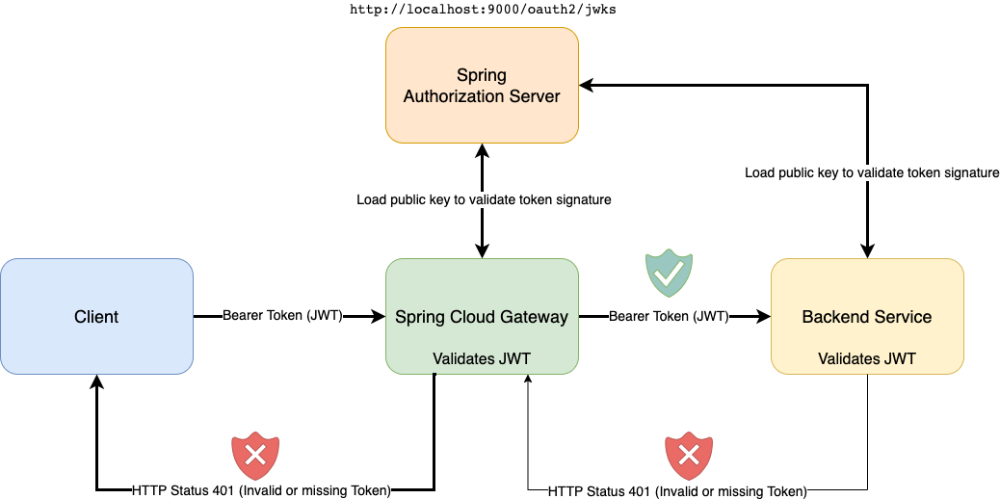

# Lab 3: Security Part 1 - Authentication with JWT

In this lab we add token-based (JWT) user authentication to the gateway.

> See 
> * [Spring Cloud Token Relay](https://docs.spring.io/spring-cloud-gateway/docs/current/reference/html/#the-tokenrelay-gatewayfilter-factory)
> * [Spring Security OAuth 2.0 Resource Server](https://docs.spring.io/spring-security/reference/reactive/oauth2/resource-server/jwt.html)
> * [OAuth 2.0 (RFC 6749)](https://www.rfc-editor.org/rfc/rfc6749.html)
> * [JSON Web Tokens (JWT, RFC 7519)](https://www.rfc-editor.org/rfc/rfc7519.html)
> 
> for all details on authentication with spring cloud gateway using OAuth 2 and JSON web tokens.  

## Lab Contents

* [Learning Targets](#learning-targets)
* [Folder Contents](#folder-contents)
* [Tutorial: Security Part 1 - Authentication with JWT](#start-the-lab)
    * [Explore the initial gateway application](#explore-the-initial-application)
    * [Step 1: Extend the Gateway to act as OAuth Resource Server](#step-1-extend-the-gateway-to-act-as-oauth-resource-server)
    * [Step 2: Re-configure the Rate-Limiter of lab 2](#step-2-re-configure-the-rate-limiter-of-lab-2)

## Learning Targets

One cross-cutting feature of an API Gateway is user authentication. This way the gateway can block calls without valid authentication before the call hits the backend service.  
When talking about authentication in context of Microservices architectures the standard way is token-based authentication with tokens getting issued using [OAuth 2.0](https://www.rfc-editor.org/rfc/rfc6749.html) and [OpenID Connect 1.0](https://openid.net/specs/openid-connect-core-1_0.html) standard protocols.

In general Spring Cloud Gateway can act in two different roles:

* As __OAuth client__:  
  In this scenario, first the gateway checks if the incoming request is already authenticated (i.e. having valid bearer token). If no valid authentication is detected then it will initiate an OAuth/OpenID Connect authorization code grant flow to get a token.
* As __OAuth resource server__:  
  Here, the gateway just checks the incoming request if it is authenticated (having a valid token). If authentication is valid it propagates the same token to the backend service call.

In lab 3 you will learn how to:

* Configure the gateway to validate incoming JSON web tokens (JWT) issued by the Spring Authorization Server
* Re-configure the [rate limiter](https://www.cloudflare.com/en-gb/learning/bots/what-is-rate-limiting/) of lab 2 to use the standard user principle based key resolver instead of our custom one.

In the reference solution you'll find both scenarios described above. Just start the reference solution in _/lab3/solution/api-gateway_ with the corresponding spring profile:

* __oauth-client__: This profile configures the gateway as OAuth client. To use this make a request using the web browser to see the gateway redirecting to the spring authorization server to get a token before making the backend service call
* __resource-server__: This profile configures the gateway as OAuth resource server. This is the solution to the steps we will implement as part of this lab

## Folder Contents

In the lab 3 folder you find 2 applications:

* __initial__: This is the gateway application we will use as starting point for this lab
* __solution__: This is the completed reference solution of the gateway application for this lab including both scenarios acting as OAuth client or OAuth resource server

## Start the Lab

Now, let's start with this lab.

### Explore the initial application

Please navigate your Java IDE to the __lab3/initial/api-gateway__ project and explore this project a bit. Then start the application by running the class `com.example.apigateway.ApiGatewayApplication` inside your IDE  
or by issuing a `mvnw[.sh|.cmd] spring-boot:run` command.

If you have not yet seen the sample application architecture we will be building then please have a look into the [sample application architecture](../architecture).

For this lab we will also need the two provided sample backend services that you can find in the _microservices_ root folder:

* __product-service__: Provides a REST API for products
* __customer-service__: Provides a REST API for customers

To test if the backend microservice applications works as expected, please run the corresponding spring boot starter classes.

> __Note:__ This time please start both applications using the `secure` spring profile. By using this profile the applications now require a valid JWT to call API endpoints

After starting the applications please check if you can access the following REST API endpoints via the browser or the provided postman collection in _/setup/postman_ (requests located in the _Security-Authentication_ folder) .

* [localhost:9091/api/v1/customers](http://localhost:9091/api/v1/customers)
* [localhost:9092/api/v1/products](http://localhost:9092/api/v1/products)

You may also use a command-line client as well.
Here are example requests using _httpie_ and _curl_.

Httpie:
```shell
http localhost:9091/api/v1/customers
http localhost:9092/api/v1/products
``` 

Curl:
```shell
curl http://localhost:9091/api/v1/customers
curl http://localhost:9092/api/v1/products
```

You will notice that you are not able to call the REST API endpoints successfully. Instead, you get a `401 (Unauthorized)` HTTP status.
The same will happen if you try to make the calls through the gateway.

Before proceeding with the lab, please also make sure you have also set up and started the Spring Authorization Server as this will be required by the gateway and the backend services to validate the tokens.

<hr>

### Step 1: Extend the gateway to act as OAuth resource server

In the first step of this lab we will extend the gateway to act as [OAuth2 resource server](https://www.oauth.com/oauth2-servers/the-resource-server/).



First, we have to add another dependency for the OAuth resource server spring boot starter feature to the maven `pom.xml` file:

__pom.xml:__

```xml
<dependencies>
    ...
  <dependency>
    <groupId>org.springframework.boot</groupId>
    <artifactId>spring-boot-starter-oauth2-resource-server</artifactId>
  </dependency>
    ...
</dependencies>
```

The additional dependency adds the [spring security](https://spring.io/projects/spring-security) library and the filter functionality to resolve and validate [bearer tokens](https://oauth.net/2/bearer-tokens/) from the requests.  
As we will use [JSON web tokens (JWT)](https://jwt.io/) in our lab, these kind of tokens have to be validated by checking the token signature and the expiry date/time. In our case the token signature is based on [asymmetric cryptography](https://en.wikipedia.org/wiki/Public-key_cryptography). To validate the signature we need a [public key](https://en.wikipedia.org/wiki/Public_key_infrastructure).  
Next we have to tell the gateway where to retrieve this public key from (it is the Spring Authorization Server that provides this at a publicly accessible endpoint as part of a [JSON Web Key Set](https://auth0.com/docs/secure/tokens/json-web-tokens/json-web-key-sets)).

Please open the file `src/main/resources/application.yml` in the _/lab3/initial/api-gateway_ project and add the following entries on the level of the _spring_ path:

__application.yml:__

```yaml
spring:
  #...
  security:
    oauth2:
      resourceserver:
        jwt:
          jwk-set-uri: http://localhost:9000/oauth2/jwks
```

This defines to load the required public key from [localhost:9000/oauth2/jwks](http://localhost:9000/oauth2/jwks).  

> __Note:__  
> Spring Security also caches all retrieved public keys. As long as the key id (header value _kid_) of a JWT matches the key id of a cached public key, then the token can directly be validated with this cached one.  
> If no matching public key is found in the cache then Spring Security connects the Spring Authorization Server again to load public key(s) and invalidate the current cached ones.

Finally, we need some java configuration in the `WebSecurityConfiguration` class to enable the authentication for bearer tokens (requiring JWT).

__WebSecurityConfiguration.java:__

```java
package com.example.apigateway.security;

import org.springframework.context.annotation.Bean;
import org.springframework.context.annotation.Configuration;
import org.springframework.core.annotation.Order;
import org.springframework.security.config.annotation.web.reactive.EnableWebFluxSecurity;
import org.springframework.security.config.web.server.ServerHttpSecurity;
import org.springframework.security.config.web.server.ServerHttpSecurity.OAuth2ResourceServerSpec;
import org.springframework.security.web.server.SecurityWebFilterChain;
import org.springframework.security.web.server.util.matcher.PathPatternParserServerWebExchangeMatcher;

@Configuration
@EnableWebFluxSecurity
public class WebSecurityConfiguration {

  @Order(1)
  @Bean
  SecurityWebFilterChain actuatorHttpSecurity(ServerHttpSecurity http) {
    http
            .securityMatcher(new PathPatternParserServerWebExchangeMatcher("/actuator/**"))
            .authorizeExchange((exchanges) -> exchanges
                    .anyExchange().permitAll()
            );
    return http.build();
  }

  @Bean
  SecurityWebFilterChain apiHttpSecurity(ServerHttpSecurity http) {
    http
            .authorizeExchange((exchanges) -> exchanges
                    .anyExchange().authenticated()
            )
            .oauth2ResourceServer(OAuth2ResourceServerSpec::jwt)
            .csrf().disable();
    return http.build();
  }
}
```

To get more logging infos for the JWT authentication part (especially when things don't work as expected) you can set the log level to `TRACE` for spring security with ` org.springframework.security: TRACE`.

__application.yml:__

```yaml
...
logging:
  level:
    root: INFO
    com.example: DEBUG
    org.springframework.cloud.gateway: DEBUG
    org.springframework.security: TRACE
```

### Step 2: Re-configure the rate limiter of lab 2

As we now have a Principal (authenticated user) it is possible to use the default `PrincipalNameKeyResolver` implementation of Spring Cloud Gateway.

So let's remove the reference to our own key resolver implementation (again in the `application.yml` file):

__application.yml:__

```yaml
spring:
  application:
    name: api-gateway
  #...  
  cloud:
    gateway:
      routes:
        - id: products
          uri: http://localhost:9092
          predicates:
            - Path=/api/v1/products
          filters:
            - name: RequestRateLimiter
              args:
                redis-rate-limiter.replenishRate: 10
                redis-rate-limiter.burstCapacity: 10
                redis-rate-limiter.requestedTokens: 1
...
```

> See [RequestRateLimiter reference doc](https://docs.spring.io/spring-cloud-gateway/docs/current/reference/html/#the-requestratelimiter-gatewayfilter-factory) for more details.

<hr>

This ends lab 3. In the next [lab 4](../lab4) you will learn how to configure secure communication for requests using [TLS](https://www.cloudflare.com/en-gb/learning/ssl/transport-layer-security-tls/).

> **Important Note:** If you could not finish this lab, then just use the project __lab4/initial/api-gateway__ as new starting point.

<hr>

To continue please head over to [Lab 4](../lab4).