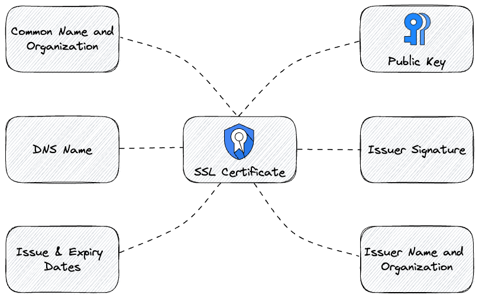

# Lab 4: Security Part 2 - Secure Communication with TLS

In this lab we secure all communication with HTTPS/TLS between clients and the gateway and in between the gateway and backend services.

> See
> * [Spring Cloud TLS and SSL](https://docs.spring.io/spring-cloud-gateway/docs/current/reference/html/#tls-and-ssl)
> * [Spring Boot: Configure SSL](https://docs.spring.io/spring-boot/docs/current/reference/html/howto.html#howto.webserver.configure-ssl)
> * [Transport Layer Security (TLS)](https://www.cloudflare.com/en-gb/learning/ssl/transport-layer-security-tls/)
>
> for all details on TLS/SSL with spring cloud gateway, TLS/SSL with Spring Boot and transport layer security (TLS) in general.

## Lab Contents

* [Learning Targets](#learning-targets)
* [Folder Contents](#folder-contents)
* [Tutorial: Security Part 2 - Secure Communication with TLS](#start-the-lab)
    * [Explore the initial gateway application](#explore-the-initial-application)
    * [Step 1: Create a PKI and local CA](#step-1-create-a-local-public-key-infrastructure-pki-and-certificate-authority-ca)
    * [Step 2: Secure communication to the gateway with TLS/SSL](#step-2-configure-the-gateway-to-communicate-via-https-tlsssl)
    * [Step 3: Secure communication between the gateway and product service with TLS/SSL](#step-3-configure-the-product-service-to-communicate-via-https-tlsssl)
    * [Step 4: Reconfigure the gateway routes to product-service](#step-4-reconfigure-the-gateway-routes-to-product-service)

## Learning Targets

Another cross-cutting feature of an API Gateway is [TLS/SSL](https://www.cloudflare.com/en-gb/learning/ssl/transport-layer-security-tls/) termination. This way all communication from clients to backend services is secured at least on its way to the gateway.

In a modern [zero-trust](https://www.ssl.com/blogs/zero-trust-architecture-a-brief-introduction/) approach it is strongly recommended to secure all communication regardless of the network location. So in addition to TLS/SSL termination at the gateway all calls from the gateway to proxied backend services must use secure communication using TLS/SSL as well.

In lab 4 you will learn how to:

* Create a local PKI and generate trusted [TLS/SSL](https://www.cloudflare.com/en-gb/learning/ssl/transport-layer-security-tls/) [certificates](https://www.cloudflare.com/en-gb/learning/ssl/what-is-an-ssl-certificate/) using the tool [mkcert](https://github.com/FiloSottile/mkcert) and store these in a java keystore 
* Configure the gateway to provide the [HTTPS](https://www.cloudflare.com/en-gb/learning/ssl/what-is-https/) protocol instead of HTTP using a trusted self-signed certificate
* Configure one of the backend services (the _product-service_) as well to use [TLS/SSL](https://www.cloudflare.com/en-gb/learning/ssl/transport-layer-security-tls/) and change the gateway routes to call the HTTPS endpoints

In this lab you find both the _api-gateway_ and the _product-service_ in the _initial_ and _solution_ folders as we also will change the _product-service_ as part of this lab to serve resources via [TLS/SSL](https://www.cloudflare.com/en-gb/learning/ssl/transport-layer-security-tls/).

## Folder Contents

In the lab 4 folder you find 4 applications:

* __initial__: This includes the gateway and product-service applications we will use as starting point for this lab
* __solution__: This is the completed reference solution of the gateway and product-service applications for this lab configured using TLS/SSL secured communication

## Start the Lab

Now, let's start with this lab.

### Explore the initial application

Please navigate your Java IDE to the __lab4/initial/api-gateway__ project and explore this project a bit. Then start the application by running the class `com.example.apigateway.ApiGatewayApplication` inside your IDE  
or by issuing a `mvnw[.sh|.cmd] spring-boot:run` command.

If you have not yet seen the sample application architecture we will be building then please have a look into the [sample application architecture](../architecture).

In this lab the two provided sample backend services in the _microservices_ root folder will __not__ be required.
Instead, we will use the _product-service_ in the _initial_ folder of lab 4.

To test if the _product-service_ backend microservice application and the gateway works as expected, please run the corresponding spring boot starter class.

> __Note:__ Again please start the application using the `secure` spring profile. By using this profile the application now require a valid JWT to call API endpoints

After starting the applications please check if you can access the following REST API endpoints via the browser or the provided postman collection in _/setup/postman_.

* [localhost:9092/api/v1/products](http://localhost:9092/api/v1/products)

You may also use a command-line client as well.
Here are example requests using _httpie_ and _curl_.

Httpie:
```shell
http localhost:9092/api/v1/products
``` 

Curl:
```shell
curl http://localhost:9092/api/v1/products
```

You will still need a valid JWT from the Spring Authorization Server (via postman) to be able to call the REST API endpoints successfully. Otherwise, you get a `401 (Unauthorized)` HTTP status.
The same will happen if you try to make the calls through the gateway.

So, please make sure you still have the Spring Authorization Server running as this will be required by the gateway and the backend services to validate the tokens.

<hr>

### Step 1: Create a local Public Key Infrastructure (PKI) and Certificate Authority (CA)

A [Public Key Infrastructure (PKI)](https://blog.cloudflare.com/how-to-build-your-own-public-key-infrastructure/) is an arrangement that binds public keys with respective identities of entities, such as people and organizations, through a process of registration and issuance of certificates at and by a Certificate Authority (CA). A trusted CA is the only entity in PKI that can issue trusted digital certificates.



We will establish a Private Public Key Infrastructure (Private PKI) with an internal Certificate Authority (CA) that is not publicly trusted just for development purposes.  
This is quite easy to achieve by using the tool [mkcert](https://github.com/FiloSottile/mkcert).  
[mkcert](https://github.com/FiloSottile/mkcert) automatically creates and installs a local CA in the system root store, and generates locally-trusted certificates.

Please follow the [mkcert installation](https://github.com/FiloSottile/mkcert#installation) section on how to install this on your local machine.

[mkcert](https://github.com/FiloSottile/mkcert) supports the following root stores:

* macOS's system store
* Windows system store
* Linux variants that provide either
  * update-ca-trust (Fedora, RHEL, CentOS) or
  * update-ca-certificates (Ubuntu, Debian, OpenSUSE, SLES) or
  * trust (Arch)
* Firefox (macOS and Linux only)
* Chrome and Chromium
* Java (when _JAVA_HOME_ is set)

To also install the CA certificate into the Java trust store you have to set `export JAVA_HOME=...` to point to your Java JDK location before the next step.  
Now execute the following command to create the local CA.

```shell
mkcert -install
```

This should return an info message for the installation locations like this:

```shell
Created a new local CA 💥
The local CA is now installed in the system trust store! ⚡️
The local CA is now installed in Java's trust store! ⚡️
The local CA is now installed in the Firefox trust store (requires browser restart)! 🦊
```

After we have established our local CA we now can issue certificates that are trusted on the local machine.  
So let's issue a new certificate that is stored in a Java Keystore using this command:

```shell
mkcert -p12-file server-keystore.p12 -pkcs12 localhost
```

This should lead to the following output:

```shell
Created a new certificate valid for the following names 📜
 - "localhost"

The PKCS#12 bundle is at "server-keystore.p12" ✅
The legacy PKCS#12 encryption password is the often hardcoded default "changeit" ℹ️
It will expire on 15 August 2025 🗓
```

This has generated a valid certificate for the _localhost_ domain in the file _server-keystore.p12_ secured with the password _changeit_.
We will need this file for the next two steps to configure both, the api gateway and the product service.

### Step 2: Configure the gateway to communicate via HTTPS (TLS/SSL)

In this step of the lab we will extend the gateway to secure all communications with the client using TLS/SSL.
TLS/SSL requires the corresponding [X509 certificate](https://www.cloudflare.com/en-gb/learning/ssl/what-is-an-ssl-certificate/) we have created in the previous step.

Copy the created file _server-keystore.p12_ from the previous step to the resource directory of the initial api gateway (_/lab4/initial/api-gateway/src/main/resources_).  
Next we can enable TLS/SSL for the api gateway.  
To do this please open the file `src/main/resources/application.yml` in the _/lab4/initial/api-gateway_ project and add the following entries on the level of the _spring_ path:

__application.yml:__

```yaml
...
server:
  port: 8443
  error:
    include-stacktrace: never
  ssl:
    enabled: true
    key-alias: 1
    key-store-password: changeit
    key-store: classpath:server-keystore.p12
    key-store-type: PKCS12
...
```

> __Info:__  
> Now the api gateway will run on [https://localhost:8443](https://localhost:8443).

Before re-starting the api gateway please add one more thing to the `WebSecurityConfiguration.java` class.  
Please add the additional line `.headers(header -> header.hsts().disable())` to switch off [HTTP Strict Transport Security (HSTS)](https://developers.cloudflare.com/ssl/edge-certificates/additional-options/http-strict-transport-security/).  

> If we do not switch off HSTS then loading the api gateway using HTTPS will lead to enforce always the HTTPS protocol for all applications you will run on localhost.  
> This will cause problems in other applications that are not configured to run using HTTPS.  
> If you are running into this kind of problem please read [here](https://msutexas.edu/library/clearhsts.php) to reset this behaviour in your web browser.

__WebSecurityConfiguration.java:__

```java
package com.example.apigateway.security;

import org.springframework.context.annotation.Bean;
import org.springframework.context.annotation.Configuration;
import org.springframework.core.annotation.Order;
import org.springframework.security.config.annotation.web.reactive.EnableWebFluxSecurity;
import org.springframework.security.config.web.server.ServerHttpSecurity;
import org.springframework.security.config.web.server.ServerHttpSecurity.OAuth2ResourceServerSpec;
import org.springframework.security.web.server.SecurityWebFilterChain;
import org.springframework.security.web.server.util.matcher.PathPatternParserServerWebExchangeMatcher;

@Configuration
@EnableWebFluxSecurity
public class WebSecurityConfiguration {

  @Order(1)
  @Bean
  SecurityWebFilterChain actuatorHttpSecurity(ServerHttpSecurity http) {
    http
            .securityMatcher(new PathPatternParserServerWebExchangeMatcher("/actuator/**"))
            .headers(header -> header.hsts().disable())
            .authorizeExchange((exchanges) -> exchanges
                    .anyExchange().permitAll()
            );
    return http.build();
  }

  @Bean
  SecurityWebFilterChain apiHttpSecurity(ServerHttpSecurity http) {
    http
            .headers(header -> header.hsts().disable())
            .authorizeExchange((exchanges) -> exchanges
                    .anyExchange().authenticated()
            )
            .oauth2ResourceServer(OAuth2ResourceServerSpec::jwt)
            .csrf().disable();
    return http.build();
  }
}
```

### Step 3: Configure the product-service to communicate via HTTPS (TLS/SSL)

In the third step of this lab we will do the same for the product service to secure all communications between the api gateway and the product service using TLS/SSL.
TLS/SSL requires the corresponding [X509 certificate](https://www.cloudflare.com/en-gb/learning/ssl/what-is-an-ssl-certificate/) we created in the first step.

Copy the created file _server-keystore.p12_ from the first step to the resource directory of the initial _product-service_ (_/lab4/initial/product-service/src/main/resources_).

Let's add the same configuration of TLS/SSL for the _product-service_ using the keystore we just have created (again in the `application.yml` file):

__application.yml:__

```yaml
...
server:
  port: 8444
  error:
    include-stacktrace: never
  ssl:
    enabled: true
    key-alias: 1
    key-store-password: changeit
    key-store: classpath:server-keystore.p12
    key-store-type: PKCS12
...
```

> __Info:__ Now the _product-service_ will run on [https://localhost:8444](https://localhost:8444).

Before re-starting the _product-service_ please add one more thing to the `WebSecurityConfiguration.java` class.  
Please add the additional line `.headers(header -> header.httpStrictTransportSecurity().disable())` to switch off [HTTP Strict Transport Security (HSTS)](https://developers.cloudflare.com/ssl/edge-certificates/additional-options/http-strict-transport-security/).

> If we do not switch off HSTS then loading the api gateway using HTTPS will lead to enforce always the HTTPS protocol for all applications you will run on localhost.
> This will cause problems in other applications that are not configured to run using HTTPS.  
> If you are running into this kind of problem please read [here](https://msutexas.edu/library/clearhsts.php) to reset this behaviour in your web browser.

__WebSecurityConfiguration.java:__

```java
package com.example.productservice.config;

import org.springframework.context.annotation.Bean;
import org.springframework.context.annotation.Configuration;
import org.springframework.context.annotation.Profile;
import org.springframework.security.config.annotation.web.builders.HttpSecurity;
import org.springframework.security.config.annotation.web.configuration.EnableWebSecurity;
import org.springframework.security.web.SecurityFilterChain;

@EnableWebSecurity
@Configuration
public class WebSecurityConfiguration {

  @Profile("secure")
  @Bean
  public SecurityFilterChain apiSecurity(HttpSecurity httpSecurity) throws Exception {
    httpSecurity
            .headers(header -> header.httpStrictTransportSecurity().disable())
            .authorizeHttpRequests().anyRequest().authenticated()
            .and().oauth2ResourceServer().jwt();
    return httpSecurity.build();
  }

  @Profile("!secure")
  @Bean
  public SecurityFilterChain apiSecurityUnAuthenticated(HttpSecurity httpSecurity) throws Exception {
    httpSecurity
            .headers(header -> header.httpStrictTransportSecurity().disable())
            .authorizeHttpRequests().anyRequest().permitAll()
            .and().oauth2ResourceServer().jwt();
    return httpSecurity.build();
  }
}
```

### Step 4: Reconfigure the gateway routes to product-service

In the last step we need to change the existing routes to the _product-service_ to actually use the HTTPS protocol now.

__application.yml:__

```yaml
...
  cloud:
    gateway:
      httpclient:
        ssl:
          useInsecureTrustManager: false
      routes:
        - id: products
          uri: https://localhost:8444
          predicates:
            - Path=/api/v1/products
          filters:
            - name: RequestRateLimiter
              args:
                redis-rate-limiter.replenishRate: 10
                redis-rate-limiter.burstCapacity: 10
                redis-rate-limiter.requestedTokens: 1
...
```

The most important change is of course the adapted URI: `uri: https://localhost:8444` using secured communication to the product-service now.  
Please also look at the property `cloud.gateway.httpclient.ssl.useInsecureTrustManager`. If you are using certificates that are not trusted then you have to set this property to `true`.
If you have performed all previous steps using _mkcert_ and you are using the same JDK the CA root certificate was installed by _mkcert_ then we use trusted certificates and this property can be set to `false` or be removed.

Now you can run both applications the _api-gateway_ and the _product-service_ and try if the communication via HTTPS works between your client (web browser and/or postman) and between the _api-gateway_ and the _product-service_.  The web browser should also show the certificate as a valid one.

<hr>

This ends lab 4 and the hands-on parts.

If you want to learn more about TLS/SSL and also want to configure client certificates please check another GitHub repository at [https://github.com/andifalk/client-certificate-demo](https://github.com/andifalk/client-certificate-demo).

