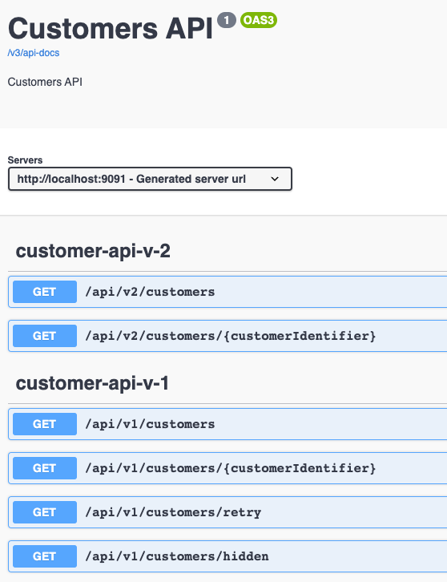
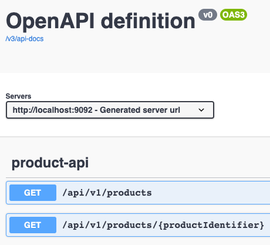

# Sample Backend Microservices

We need some proxied backend services to play around with the Spring Cloud Gateway.

That is why the following spring boot API services are provided as part of the workshop in the _/microservices_ directory:

* customer-service
* product-service

Service URLs:

| Service                         | URL                   | Secure URL (TLS Lab)   |
|---------------------------------|-----------------------|------------------------|
| Customer Service (Customer API) | http://localhost:9091 | --                     |
| Product Service (Products API)  | http://localhost:9092 | https://localhost:8444 |

## Customer Service

The customer service provides a Swagger UI documentation for all provided APIs at [http://localhost:9091/swagger-ui.html](http://localhost:9091/swagger-ui.html).

## Product Service

The product service provides a Swagger UI documentation for all provided APIs at [http://localhost:9092/swagger-ui.html](http://localhost:9092/swagger-ui.html).

You find the corresponding requests in the provided Postman collection (see directory _/setup/postman) as well.

## Running these Services

To run spring boot services you can use the provided starting capabilities of your Java IDE or use the spring boot maven plugin:

`mvn spring-boot:run`

For more information on running spring boot applications please check the [Spring Boot reference docs section](https://docs.spring.io/spring-boot/docs/current/reference/html/using.html#using.running-your-application).

Both applications support an insecure (unauthenticated) or secure (authentication using JWTs) mode. 
By default, the _insecure_ mode is used.

To activate the _secure_ mode please start the corresponding application with the `secure` profile.
Either specify the profile in your IDE or use the spring boot maven plugin for this.

`mvn spring-boot:run -Dspring-boot.run.profiles=secure`

Just look into the [Spring Boot reference section ](https://docs.spring.io/spring-boot/docs/current/reference/html/howto.html#howto.properties-and-configuration.set-active-spring-profiles) on how to set the active profile.
