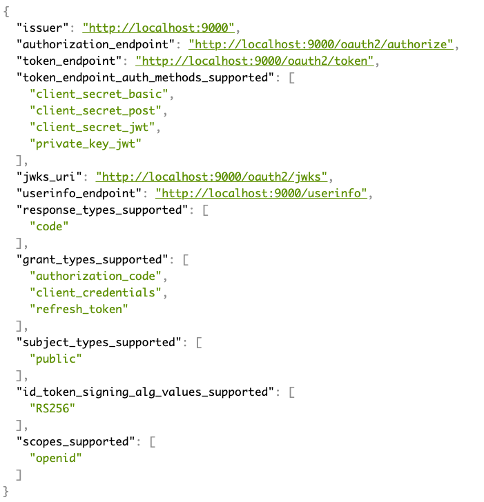

# Setup

## Import the workshop project into your IDE

1. Clone the git repository https://github.com/andifalk/spring-cloud-gateway-workshop or download it as zip file
2. Import the whole directory into your Java IDE as __Maven__ project
    * IntelliJ: File/New/Project from existing sources -> Select directory -> Select __Maven__ in next step
    * Eclipse: File/Import -> Select '__Maven__'/'__Existing Maven Projects__' -> Select directory -> Click 'Finish'
    * Visual Studio Code: Just open the directory with VS Code -> VS Code should automatically configure the project
3. You might have to explicitly trigger an update for the maven configuration to load dependencies (depending on your IDE)

## Run the java applications

All spring boot based java projects can either be run using your Java IDE or using the command line
with changing into the corresponding project directory and issuing a `./gradlew bootRun` command.

## Spring Authorization Server

In this workshop we will use a customized version of [Spring Authorization Server](https://github.com/spring-projects/spring-authorization-server) as local identity provider.  
[Spring Authorization Server](https://github.com/spring-projects/spring-authorization-server) implements OAuth 2.0 and OpenID Connect 1.0.

This version contains pre-configured users and registered OAuth/OIDC clients that we will use for both, the provided sample backend applications (customer and product APIs) and the Spring Cloud Gateway we will implement as part of this workshop.

To set up and run the customized Spring Authorizationserver:

1. Clone or download the GitHub repository at: [https://github.com/andifalk/custom-spring-authorization-server](https://github.com/andifalk/custom-spring-authorization-server)
2. Import this project into your IDE as a gradle project
3. After the IDE has configured the project you can start the authorization server by running the main class _com.example.spring.authorizationserver.SpringAuthorizationServerApplication_

### Check Running Server

The spring authorization server runs on port _9000_. To validate that it is running as expected, please open the web browser and navigate to the [OpenID Connect discovery endpoint](http://localhost:9000/.well-known/openid-configuration).

If you can see the openid configuration in the browser (how nice it is shown depends on your browser addons) then spring authorization server is ready for use in this workshop.

You can use the following users to log into the custom Spring Authorization Server:

| User / Password   | Role(s)     |
|-------------------|-------------|
| bwayne / wayne    | USER        |
| pparker / parker  | USER, ADMIN |
| ckent / kent      | USER        |

## Docker and docker compose

If you want to follow configuring a rate limiter as part of hands-on lab 2 you will need to run a container image with a redis database.  
Therefore a container runtime is required.  

If you don't have already _docker_ installed on your machine please open the corresponding [docker installation](https://docs.docker.com/get-docker/) location and follow instructions there.  
With Docker Desktop you already have docker compose installed.  Other installations like standalone engine on Linux require an additional [installation of docker compose](https://docs.docker.com/get-started/08_using_compose/).

> In case you have installed another container runtime like [Rancher Desktop](https://rancherdesktop.io/) this should also work, as long as docker compose is supported by that solution.

## mkcert - Create a local Certificate Authority (CA)

[mkcert](https://github.com/FiloSottile/mkcert) is a helpful tool to create a local CA for Lab 4 to configure TLS/SSL for the api gateway.
Please follow the [mkcert installation](https://github.com/FiloSottile/mkcert#installation) section on how to install this on your local machine.
